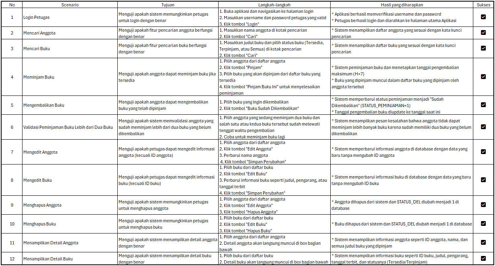

# Aplikasi Manajemen Peminjaman Buku

Aplikasi ini adalah sistem manajemen peminjaman buku untuk perpustakaan. Aplikasi ini memungkinkan petugas untuk mengelola anggota, buku, serta transaksi peminjaman dan pengembalian buku dengan mudah. Pengguna dapat melakukan pencarian anggota, meminjam buku, mengembalikan buku, serta melihat riwayat peminjaman.

## CDM (Conceptual Data Model)
Berikut adalah model konseptual yang menggambarkan hubungan antara entitas dalam sistem manajemen peminjaman buku.


Gambar 1: CDM untuk Aplikasi Manajemen Peminjaman Buku

## PDM (Physical Data Model)
Di bawah ini adalah model fisik yang menunjukkan implementasi struktur tabel di database, termasuk relasi dan tipe data.


Gambar 2: PDM untuk Aplikasi Manajemen Peminjaman Buku

## Wireframe
Wireframe ini dibuat untuk memberikan gambaran visual tentang antarmuka pengguna aplikasi Manajemen Peminjaman Buku. Wireframe ini dirancang untuk memudahkan navigasi dan memvisualisasikan alur pengguna dalam aplikasi.


Gambar 3: Wireframe Aplikasi Manajemen Peminjaman Buku

Untuk melihat desain wireframe secara detail dan berinteraksi dengan prototipe, kunjungi tautan Figma berikut:
[Wireframe Aplikasi Manajemen Peminjaman Buku](https://www.figma.com/proto/C7yK1FLsR1njO0HFG5xYdX/Untitled?node-id=10-133&p=f&t=uHXI7yDdH12siR1J-1&scaling=contain&content-scaling=fixed&page-id=0%3A1&starting-point-node-id=10%3A133)

## Fitur Utama
1. **Login Petugas**
   - Petugas dapat masuk menggunakan username dan password yang sudah terdaftar di sistem.
   
2. **Manajemen Anggota**
   - Petugas dapat melihat daftar anggota, menambah anggota baru, mengedit data anggota, dan menghapus anggota.
   
3. **Manajemen Buku**
   - Petugas dapat melihat daftar buku, menambah buku baru, mengedit data buku, dan menghapus buku yang sudah tidak tersedia.

4. **Peminjaman Buku**
   - Petugas dapat meminjamkan buku kepada anggota, dengan validasi buku yang tersedia dan anggota yang dapat meminjam.
   - Sistem akan mengupdate status peminjaman dan memberikan tenggat waktu pengembalian.

5. **Pengembalian Buku**
   - Petugas dapat memproses pengembalian buku, mengupdate tanggal kembali, dan mengubah status peminjaman.

6. **Laporan Peminjaman**
   - Petugas dapat melihat daftar peminjaman buku beserta statusnya (belum dikembalikan/sudah dikembalikan) dan tanggal pengembaliannya.

## Teknologi yang Digunakan
- **C#**: Bahasa pemrograman untuk pengembangan aplikasi desktop.
- **MySQL**: Database untuk menyimpan data buku, anggota, dan peminjaman.
- **Windows Forms**: UI framework untuk membangun antarmuka pengguna desktop.

## Prasyarat
Sebelum menjalankan aplikasi ini, pastikan Anda sudah memiliki:
1. **.NET Framework** versi 4.7.2 atau yang lebih baru.
2. **MySQL Server** yang terinstal dan database sudah tersedia.
3. **MySQL.Data** NuGet package yang diinstal dalam proyek.

## Instalasi

1. Clone repositori ini ke komputer lokal Anda:
   ```bash
   git clone https://github.com/LisandraN08/SertifikasiLSP.git
   ```

2. Buka proyek di Visual Studio.

3. Pastikan Anda menginstal package `MySql.Data` melalui NuGet:
   - Buka **NuGet Package Manager** di Visual Studio.
   - Cari `MySql.Data` dan install versi terbaru.

4. Setel konfigurasi database di dalam kode:
   - Pastikan Anda mengubah string koneksi `connstring` di aplikasi untuk mencocokkan detail koneksi MySQL yang Anda gunakan (username, password, database).

## Penggunaan

1. **Login sebagai petugas**:
   - Masukkan username dan password yang valid untuk petugas di halaman login.
   
2. **Menambahkan Anggota**:
   - Petugas dapat menambah anggota baru melalui form anggota.

3. **Meminjam Buku**:
   - Pilih anggota, lalu pilih buku yang akan dipinjam. Buku akan ditandai sebagai dipinjam dan statusnya akan diperbarui.
   
4. **Mengembalikan Buku**:
   - Pilih buku yang sudah dipinjam oleh anggota dan tandai sebagai sudah dikembalikan.

5. **Melihat Riwayat Peminjaman**:
   - Petugas dapat melihat status peminjaman buku dan tanggal kembali buku di bagian peminjaman.
  
## User Testing Scenario
Di bawah ini adalah tabel hasil user testing scenario yang sudah dilakukan.



Gambar 3: Tabel User Testing Scenario untuk Aplikasi Manajemen Peminjaman Buku
